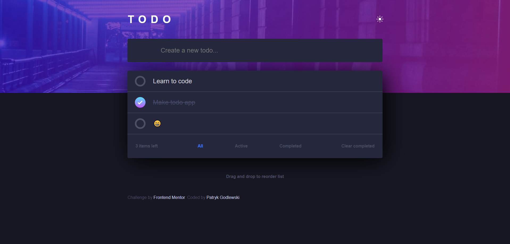

# Frontend Mentor - Todo app solution

This is a solution to the [Todo app challenge on Frontend Mentor](https://www.frontendmentor.io/challenges/todo-app-Su1_KokOW). Frontend Mentor challenges help you improve your coding skills by building realistic projects.

## Table of contents

- [Overview](#overview)
  - [The challenge](#the-challenge)
  - [Screenshot](#screenshot)
  - [Links](#links)
- [My process](#my-process)
  - [Built with](#built-with)
  - [What I learned](#what-i-learned)
- [Author](#author)

## Overview

### The challenge

Users should be able to:

- View the optimal layout for the app depending on their device's screen size
- See hover states for all interactive elements on the page
- Add new todos to the list
- Mark todos as complete
- Delete todos from the list
- Filter by all/active/complete todos
- Clear all completed todos
- Toggle light and dark mode
- **Bonus**: Drag and drop to reorder items on the list

### Screenshot

### Links

- Solution URL: [Solution](https://www.frontendmentor.io/solutions/flexbox-css-grid-sortablejs-rc0c76wwJ)
- Live Site URL: [LIVE](https://patrykgodlewski.github.io/todo-app-frontend-mentor/)

### Built with

- Semantic HTML5 markup
- SCSS
- Flexbox
- CSS Grid
- Mobile-first workflow
- [SortableJS](https://github.com/SortableJS/Sortable) - Used for sorting todos

### What I learned

Usage of Local Storage,
Better code than projects before
Usage of ES6 JS

## Author

- LinkedIn - [Patryk Godlewski](https://www.linkedin.com/in/patrykgodlewski/)
- Frontend Mentor - [@PatrykGodlewski](https://www.frontendmentor.io/profile/PatrykGodlewski)
